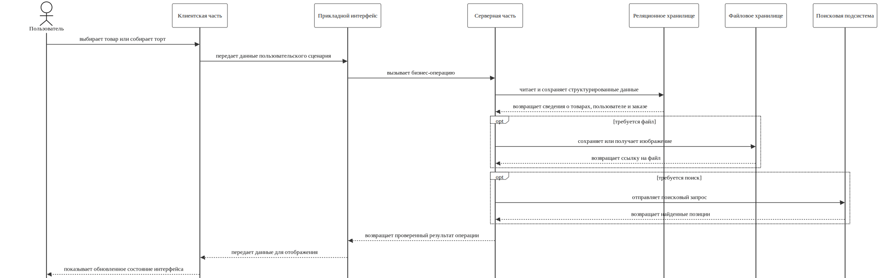
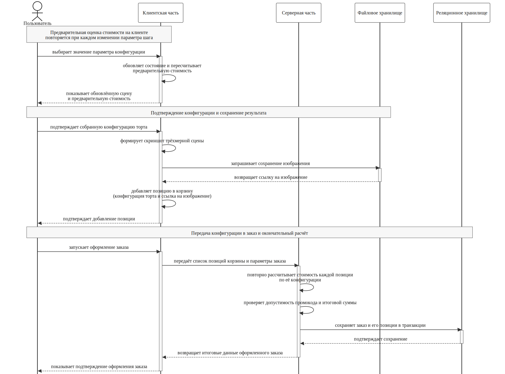

# 2 Специальный раздел

Во второй главе рассматриваются проектные решения интернет-магазина кондитерской с модулем персонализированного 3D-конструирования тортов. Система поддерживает два пользовательских сценария: выбор готовой продукции и поэтапную сборку индивидуального изделия.

В состав системы входят клиентское приложение на Next.js, сервер на NestJS, PostgreSQL с Drizzle ORM, объектное хранилище MinIO и поисковый контур Meilisearch.

## 2.1 Требования к разрабатываемой системе

Требования к системе определяются предметной областью и фактической структурой проекта. Система должна поддерживать публикацию ассортимента, персонализированный заказ с визуализацией результата, хранение конфигурации изделия и передачу этой конфигурации в заказ, понятный пользователю и администратору.

### 2.1.1 Функциональные требования

Функциональные требования к системе приведены в таблице 2.1.

**Таблица 2.1 — Функциональные требования к системе**

| Обозначение | Требование | Назначение |
| --- | --- | --- |
| Ф1 | Система должна предоставлять каталог готовой продукции с категориями, фильтрацией, сортировкой и пагинацией. | Обеспечивает быстрый просмотр ассортимента и выбор стандартных товаров. |
| Ф2 | Система должна поддерживать полнотекстовый поиск по товарам. | Сокращает время поиска нужного изделия и повышает удобство работы с каталогом. |
| Ф3 | Система должна предоставлять карточку товара с описанием, фотографиями, параметрами цены и выбора веса. | Позволяет принять решение о покупке без перехода к внешним каналам связи. |
| Ф4 | Система должна поддерживать корзину с хранением нескольких позиций разных типов. | Нужна для объединения стандартных товаров и индивидуальных конфигураций в один заказ. |
| Ф5 | Система должна обеспечивать оформление заказа с выбором даты и временного интервала самовывоза. | Формализует передачу заказа в производство и получение изделия пользователем. |
| Ф6 | Система должна предоставлять модуль регистрации, входа, выхода и восстановления пользовательской сессии. | Требуется для привязки заказов к пользователю и разделения прав доступа. |
| Ф7 | Система должна поддерживать 3D-конструктор тортов с пошаговой настройкой параметров изделия. | Решает задачу персонализации заказа и визуальной обратной связи. |
| Ф8 | Система должна рассчитывать предварительную стоимость конфигурации и повторно проверять ее на сервере. | Исключает доверие к клиентской цене и повышает целостность данных заказа. |
| Ф9 | Система должна поддерживать применение промокодов при оформлении заказа. | Расширяет механизм стимулирования продаж и управления скидками. |
| Ф10 | Система должна обеспечивать загрузку изображений через объектное хранилище по безопасной ссылке. | Нужна для хранения скриншотов конструктора и фотографий товаров. |
| Ф11 | Система должна предоставлять личный кабинет с историей заказов и каркасом для раздела избранного. | Поддерживает повторное взаимодействие пользователя с системой. |
| Ф12 | Система должна предоставлять административный контур для управления товарами, заказами, ингредиентами конструктора, пользователями и промокодами. | Обеспечивает эксплуатацию и сопровождение системы без прямого редактирования базы данных. |

Функциональная модель системы включает два сценария: стандартный заказ готовой продукции и сборку индивидуального торта. Во втором сценарии система работает с объектом конфигурации, содержащим форму, состав слоев, покрытие, декор и параметры расчета стоимости.

Модуль избранного предусмотрен архитектурой. В базе данных для него используется сущность `favorites`, а в личном кабинете выделен отдельный раздел. Полный пользовательский сценарий для этого модуля не реализован.

Административный контур включает обработку заказов, управление каталогом, настройку ингредиентов конструктора, управление пользователями и промокодами. Эти функции нужны для полного цикла сопровождения заказа после его оформления.

### 2.1.2 Нефункциональные требования

Нефункциональные требования к системе приведены в таблице 2.2.

**Таблица 2.2 — Нефункциональные требования к системе**

| Обозначение | Требование | Практический смысл |
| --- | --- | --- |
| НФ1 | Система должна корректно работать на настольных и мобильных устройствах. | Пользователь взаимодействует с каталогом и конструктором с разных типов устройств. |
| НФ2 | Интерфейс должен обеспечивать приемлемое время отклика при смене шагов конструктора и работе с каталогом. | Поддерживает непрерывность сценария заказа и не создает ощущения задержки. |
| НФ3 | Система должна сохранять целостность данных заказа за счет серверной валидации и пересчета стоимости. | Исключает неконсистентные конфигурации и подмену цены на клиенте. |
| НФ4 | Система должна обеспечивать безопасную аутентификацию и защиту изменяющих запросов. | Снижает риск несанкционированного доступа и подделки действий пользователя. |
| НФ5 | Архитектура должна быть модульной и расширяемой. | Позволяет без радикальной переработки добавлять новые сценарии и модули. |
| НФ6 | Система должна сохранять работоспособность при частичной недоступности вспомогательных сервисов. | Требуется для устойчивой работы при сбоях API ингредиентов, поиска или файлового хранилища. |
| НФ7 | Проект должен поддерживать единый типовой контракт между клиентской и серверной частями. | Уменьшает количество ошибок интеграции и упрощает сопровождение. |
| НФ8 | Данные должны храниться в структуре, пригодной для аналитики и дальнейшего расширения. | Важно для ведения заказов, истории пользователя и отчетности. |

Нефункциональные требования задают условия устойчивой работы каталога, checkout и конструктора. Базовыми требованиями остаются согласованность данных, устойчивость пользовательского сценария и расширяемость архитектуры.

Адаптивность требует сохранения одного сценария работы на настольных и мобильных устройствах. Для конструктора это означает одинаковую последовательность шагов при разной компоновке экрана.

Отказоустойчивость распространяется и на внешние сервисы. При недоступности Meilisearch каталог продолжает работать без поиска, при недоступности API ингредиентов конструктор использует локальный резерв, а ошибка загрузки изображения не должна прерывать оформление заказа.

## 2.2 Проектирование архитектуры системы

Архитектура системы проектируется как модульное веб-приложение. В ее состав входят публичная витрина, 3D-конструктор, оформление заказа, личный кабинет, административная часть и внешние сервисы.

Клиентская часть отвечает за отображение экранов, ввод данных и управление пользовательским сценарием. Через нее пользователь просматривает каталог, открывает карточку товара, собирает торт в конструкторе, работает с корзиной, оформляет заказ и обращается к личному кабинету.

Серверная часть выполняет обработку бизнес-операций. Она разделяется на модули каталога, авторизации, заказов, конструктора, загрузки файлов, промокодов, поиска и административного управления. Такое разделение фиксирует границы ответственности и снижает связанность между подсистемами.

Слой хранения данных предназначен для размещения сведений о пользователях, товарах, заказах, позициях заказа, промокодах и параметрах конструктора. Для этой части системы требуется реляционная модель, так как основные сущности имеют устойчивые связи и должны сохранять целостность при изменении данных.

Файловое хранилище выделяется в отдельный контур. В нем размещаются изображения товаров и графические материалы, связанные с индивидуальной конфигурацией торта. Такое разделение не смешивает бинарные файлы с основной реляционной моделью.

Поисковая подсистема проектируется отдельно от основной базы данных. Она обслуживает быстрый поиск по каталогу и не должна блокировать просмотр ассортимента при частичной недоступности.

На рисунке 2.1 показана компонентная схема архитектуры системы.

*Рисунок 2.1 — Компонентная схема архитектуры системы.*

На рисунке 2.2 показана схема взаимодействия сервисов веб-приложения.

*Рисунок 2.2 — Схема взаимодействия сервисов веб-приложения.*

Взаимодействие между клиентской и серверной частями строится через прикладной интерфейс. Клиент передает данные пользовательского сценария, а сервер проверяет допустимость операций, рассчитывает стоимость и сохраняет результат.

Такое распределение сохраняет границы между представлением, бизнес-логикой и хранением данных. Клиентская часть не принимает окончательных решений о цене и допустимости заказа, а серверная часть не отвечает за визуальную организацию пользовательского сценария.

## 2.3 Проектирование модуля 3D-конструктора тортов

3D-конструктор является центральным модулем системы. Он обеспечивает пошаговую настройку изделия, построение 3D-сцены, предварительный расчет стоимости и подготовку данных для сохранения заказа.

### 2.3.1 Логика пошаговой сборки торта

Конструктор организован как пошаговый мастер из пяти этапов. Разбиение на шаги упорядочивает выбор параметров и позволяет контролировать полноту конфигурации.

На первом шаге задаются форма и количество ярусов. На втором шаге для каждого яруса выбираются основа и вес. На третьем шаге задается начинка каждого яруса. На четвертом шаге выбираются покрытие и визуальный режим оформления. На пятом шаге добавляются декор, свеча и текст надписи.

Переходы между шагами ограничиваются проверкой валидности текущего состояния. Если обязательные параметры не заполнены, переход к следующему этапу блокируется. Это предотвращает формирование неполной конфигурации и упрощает дальнейшую сериализацию торта при добавлении в корзину.

После подтверждения результата система формирует скриншот 3D-сцены, загружает его через presigned URL в объектное хранилище и добавляет в корзину позицию типа `constructor`. Эта позиция содержит конфигурацию торта и ссылку на изображение результата.

При попытке покинуть страницу конструктор предупреждает о незавершенной конфигурации. Это снижает риск потери параметров в длинном сценарии настройки.

На рисунке 2.3 показана activity-диаграмма работы конструктора от входа на экран до добавления изделия в корзину.

*Рисунок 2.3 — Activity-диаграмма сценария работы 3D-конструктора.*

### 2.3.2 Параметры кастомизации и их влияние на 3D-сцену

Конструктор работает со структурированным объектом состояния. Он включает форму изделия, количество ярусов, массив слоев, параметры покрытия, список украшений, наличие свечи и текст надписи. Одни параметры влияют на геометрию сцены, другие — на материалы и визуальные эффекты, третьи — на стоимость и данные заказа.

Источником истины служит хранилище состояния на `zustand`. Оно синхронизирует панель шагов, блок стоимости, элементы навигации и трехмерную сцену. Изменение параметра сразу отражается в сцене и предварительном расчете.

Состояние дополнительно сохраняется в `sessionStorage`. Это позволяет восстановить конфигурацию в пределах одной браузерной сессии и сохранить переносимую структуру данных для дальнейшей сериализации.

Каталог ингредиентов загружается с серверного API и после нормализации попадает в хранилище. При недоступности API используется локальный резервный набор данных. Окончательная проверка конфигурации и стоимости выполняется на сервере.

Влияние параметров кастомизации на цену и трехмерную сцену приведено в таблице 2.3.

**Таблица 2.3 — Параметры кастомизации торта и их влияние на систему**

| Параметр | Смысл параметра | Влияние на стоимость | Влияние на 3D-сцену |
| --- | --- | --- | --- |
| `shape` | Форма торта | Добавляет процентную надбавку к базовой стоимости | Определяет геометрию корпуса и набор допустимых вариантов глазури |
| `tierCount` | Количество ярусов | Добавляет фиксированную надбавку за ярусность | Меняет состав и размеры ярусов сцены |
| `layers[].baseId` | Основа конкретного яруса | Влияет на стоимость по весу | Определяет внешний вид внутреннего слоя |
| `layers[].fillingId` | Начинка конкретного яруса | Влияет на стоимость по весу | Определяет визуальный вариант начинки |
| `layers[].weight` | Вес яруса | Используется в расчете стоимости основы и начинки | Косвенно влияет на пропорции модели |
| `coating.type` | Тип покрытия | Выбирает соответствующий ингредиент покрытия | Определяет материал и доступные варианты визуализации |
| `coating.coatingId` | Конкретный вариант покрытия | Влияет на стоимость покрытия по суммарному весу | Меняет материал внешней оболочки |
| `coating.glazeVariant` | Вариант глазури | На серверный расчет не влияет напрямую | Меняет цветовую и визуальную подачу покрытия |
| `coating.colorMode` | Режим окраски покрытия | На серверный расчет не влияет напрямую | Управляет режимом однотонной, градиентной или декоративной окраски |
| `coating.secondaryGlazeVariant` | Вторичный цвет покрытия | На серверный расчет не влияет напрямую | Нужен для градиентного режима |
| `activeDecorations` | Список выбранных украшений | Добавляет стоимость каждого украшения | Добавляет соответствующие объекты в сцену |
| `hasCandle` | Наличие свечи | Может учитываться в клиентской предварительной оценке | Добавляет декоративный объект свечи |
| `inscription` | Текст надписи | На базовый серверный расчет не влияет | Передается как сопроводительный параметр конфигурации |

Параметры визуализации и параметры денежного расчета разделяются. Варианты глазури и режимы окраски нужны для представления результата, а серверный контракт опирается на форму, вес, ингредиенты и декор.

Связь между параметрами и трехмерной моделью задается реестром GLB-ресурсов и правилами их применения. Конфигурация преобразуется в сцену через слой интерпретации, который связывает предметные параметры изделия с моделями и материалами.

На рисунке 2.4 показана схема состояний конструктора и связи хранилища состояния с трехмерной сценой.

*Рисунок 2.4 — Схема состояния конструктора и взаимодействия пользовательских параметров с 3D-сценой.*

### 2.3.3 Механизм расчёта стоимости

Стоимость индивидуального торта определяется по конфигурации изделия. В расчет входят состав слоев, масса каждого яруса, покрытие, декор, форма и число ярусов.

На клиенте используется предварительный расчет для мгновенной обратной связи. Пользователь сразу видит изменение предполагаемой стоимости при выборе основы, начинки, веса и декора.

Окончательный расчет выполняется на сервере. При создании заказа сервер заново рассчитывает стоимость каждой позиции. Для стандартных товаров применяется модель ценообразования товара, для позиции типа `constructor` используется сервис конструктора и структурированный объект конфигурации.

Расчет стоимости кастомного торта задается суммой нескольких компонентов:

\[
P = \sum_{i=1}^{n}(P_{base_i} \cdot W_i + P_{filling_i} \cdot W_i) + P_{coating} \cdot W + \sum_{j=1}^{m} P_{decor_j} + S_{shape} + S_{tier}
\]

где \(W_i\) — масса отдельного яруса, \(W\) — суммарная масса изделия, \(P_{base_i}\) и \(P_{filling_i}\) — удельная стоимость основы и начинки, \(P_{coating}\) — удельная стоимость покрытия, \(\sum P_{decor_j}\) — стоимость декоративных элементов, \(S_{shape}\) — надбавка за форму, а \(S_{tier}\) — надбавка за многоярусность.

Формула задает проектную модель расчета. Клиентская оценка нужна для навигации по сценарию настройки, окончательное решение о цене принимает сервер.

На рисунке 2.5 показана sequence-диаграмма расчета стоимости и передачи конфигурации в заказ.

*Рисунок 2.5 — Последовательность расчета стоимости и передачи конфигурации торта в заказ.*

## 2.4 Проектирование модуля каталога и оформления заказов

Модуль каталога и оформления заказов объединяет витрину товаров, корзину и серверное создание заказа. Он работает с двумя типами позиций: стандартными товарами и индивидуальными изделиями конструктора.

Сценарий работы с каталогом включает просмотр ассортимента, фильтрацию, сортировку и поиск. Затем пользователь переходит на карточку товара, где получает фотографии, описание, сведения о составе и выбирает нужный вес, если товар продается по массе. Результатом этого этапа становится позиция корзины с параметрами товара.

Корзина связывает пользовательский выбор и формальный заказ. В проекте используется единая структура элемента корзины с дискриминатором типа: `product` для стандартного товара и `constructor` для индивидуального изделия. Это позволяет обрабатывать обе разновидности позиций в одном checkout-потоке и в одной сущности `order_items`.

При переходе к оформлению заказа пользователь задает дату получения, временной интервал самовывоза, комментарий и при необходимости применяет промокод. Сервер принимает список позиций и заново пересчитывает их стоимость. Для товаров по массе используется цена за килограмм и выбранный вес, для поштучных товаров — фиксированная цена, для конструктора — стоимость по конфигурации торта. После проверки стоимости и промокода заказ сохраняется в транзакции.

Заказ в базе данных хранит только данные, прошедшие серверную проверку: дату и слот выдачи, телефон, комментарий, итоговую цену, а при применении промокода также цену до скидки, размер скидки и код промокода. Для индивидуального торта в позиции дополнительно сохраняются объект конфигурации и ссылка на изображение результата.

Поиск и промокоды входят в общий сценарий покупки. Поиск сокращает путь к карточке товара, промокоды меняют итоговую стоимость на этапе checkout.

На рисунке 2.6 показана диаграмма активности пользовательского пути от просмотра каталога до создания заказа.

*Рисунок 2.6 — Диаграмма активности сценария «каталог — корзина — оформление заказа».*

## 2.5 Проектирование модуля авторизации и личного кабинета

Модуль авторизации и личного кабинета связывает пользователя с его заказами и разделяет права доступа. Эти задачи решаются через ролевую модель и аутентификацию на основе cookie.

Регистрация и вход выполняются через серверный API. После успешной аутентификации сервер формирует JWT и помещает его в `httpOnly` cookie. При обращении к приватному маршруту сервер восстанавливает авторизованное состояние по cookie. Checkout и история заказов доступны только после входа в систему.

Личный кабинет предназначен для работы с данными пользователя и его заказами. Реализованной частью кабинета является история заказов. Пользователь может просмотреть список оформленных заказов и получить доступ к их содержимому.

Раздел избранного не реализован полностью. Для него уже существуют сущность `favorites` в базе данных и отдельный маршрут в личном кабинете.

Ролевая модель системы состоит из двух уровней: `user` и `admin`. Обычный пользователь работает с каталогом, конструктором, корзиной и личным кабинетом. Администратор управляет заказами, товарами, ингредиентами конструктора, пользователями и промокодами.

## 2.6 Проектирование базы данных

В основе хранения данных используется реляционная модель на PostgreSQL. Она подходит для работы с пользователями, товарами, категориями, заказами, позициями заказа, промокодами, избранным и каталогом ингредиентов конструктора.

Ключевыми сущностями основной предметной модели являются `users`, `categories`, `products`, `occasions`, `product_occasions`, `orders` и `order_items`. Пользователь может иметь несколько заказов. Заказ содержит одну или несколько позиций. Товар принадлежит категории. Дополнительная связь между товарами и поводами реализована как отношение многие-ко-многим через промежуточную таблицу `product_occasions`. Такая структура позволяет использовать строгую каталогизацию и тематические подборки по событиям, например по дню рождения или свадьбе.

Важное место в модели занимают сущности скидок и повторного взаимодействия: `promo_codes`, `promo_code_usages`, `favorites` и `reviews`. Промокоды хранят сам код, тип скидки, размер скидки, временные ограничения и лимиты использования. Таблица использований связывает промокод с пользователем и заказом. Таблица `favorites` формирует основу для модуля избранного. Таблица `reviews` подготовлена для хранения отзывов.

Отдельным блоком выделяется каталог ингредиентов конструктора: `constructor_bases`, `constructor_fillings`, `constructor_coatings` и `constructor_decorations`. Эти таблицы не входят напрямую в обычный товарный каталог, так как описывают не продаваемые товары, а составные элементы индивидуальной конфигурации. Именно на основе этих сущностей строится серверный каталог ингредиентов, который затем загружается в конструктор и используется в расчете стоимости.

Ключевое решение базы данных состоит в сочетании реляционной модели и `JSONB`-поля `cake_config` в таблице `order_items`. Это позволяет хранить стандартные товарные позиции и кастомные изделия в одной модели заказа. Для обычной продажи позиция хранит ссылку на товар, для индивидуального изделия — конфигурацию торта.

Схема сохраняет управляемость реляционной модели и гибкость хранения конфигурации. Новые параметры кастомизации можно добавлять без полной перестройки всей реляционной схемы.

На рисунке 2.7 представлена ER-диаграмма базы данных.

*Рисунок 2.7 — ER-диаграмма базы данных системы.*

## 2.7 Проектирование REST API

REST API служит связующим контуром между клиентской частью, административным интерфейсом и серверной логикой. Через него проходят аутентификация, каталог, конструктор, заказы, промокоды, загрузка файлов, поиск и административные операции. Все методы API сгруппированы по предметным областям, и для каждой группы определены уровень доступа, назначение и состав операций. Такая группировка отражает модульную структуру серверной части и упрощает дальнейшее сопровождение интерфейса.

Группа методов аутентификации обеспечивает регистрацию нового пользователя, вход в систему, выход из неё и получение данных текущего профиля. Регистрация и вход остаются публичными, поскольку относятся к начальным операциям пользовательского сценария и используются ещё до появления авторизованной сессии. Получение профиля требует аутентифицированной сессии, так как возвращает персональные сведения владельца аккаунта. Выход выполняется как явный метод, чтобы корректно завершать сессию и инвалидировать пользовательскую cookie. Эта группа методов формирует основу для разделения публичной и приватной частей системы.

Группа методов каталога товаров отвечает за выдачу списка ассортимента и подробной карточки отдельного товара. Все методы группы публичны: просмотр витрины не должен требовать входа в систему и не работает с чувствительной информацией. Выдача каталога поддерживает фильтрацию по категории и поводу, сортировку и постраничный вывод, что отражает функциональные требования к работе с витриной. Карточка товара возвращает полный набор сведений о продукте, включая фотографии, описание, состав, параметры цены и допустимые варианты выбора веса. Структура ответа этой группы методов остаётся стабильной для разных режимов отображения каталога — общего списка, фильтрованного списка и поисковой выдачи.

Группа методов конструктора обеспечивает чтение каталога ингредиентов и предварительный серверный расчёт стоимости конфигурации торта. Каталог ингредиентов запрашивается клиентом один раз при инициализации конструктора и используется в дальнейшем как источник данных для всех шагов мастера. При недоступности этого источника клиент переходит на локальный резервный набор данных и продолжает работать в ограниченном режиме без блокировки сценария настройки. Метод расчёта стоимости принимает структурированный объект конфигурации торта и возвращает итоговую цену с разбиением по компонентам. Этот же метод используется на этапе оформления заказа как окончательная серверная проверка корректности настройки, что соответствует требованию о недоверии к клиентской цене.

Группа методов заказов отвечает за создание заказа, выдачу истории заказов пользователя и получение содержимого отдельного заказа. Все методы этой группы требуют аутентификации, поскольку заказ привязан к пользователю и доступен только его владельцу либо администратору. Создание заказа выполняется как единая транзакционная операция, в рамках которой сервер принимает полный список позиций корзины, параметры самовывоза, контактные данные и при необходимости промокод. На стороне сервера выполняется повторный расчёт стоимости каждой позиции, проверка применимости промокода и сохранение заказа в базе данных в одной транзакции. История заказов возвращается с пагинацией и сортировкой по дате, а получение отдельного заказа дополнительно проверяет принадлежность пользователю.

Группа методов промокодов разделена по уровню доступа. Проверка промокода на этапе оформления заказа доступна аутентифицированному пользователю и возвращает результат применения скидки к корзине, включая итоговую цену и размер скидки. Управление промокодами — создание новых кодов, изменение их параметров, отключение и удаление — относится к административному контуру и недоступно обычному пользователю. Такое разделение защищает экономику системы от вмешательства со стороны клиента и одновременно сохраняет удобство работы кассового сценария.

Группа методов поиска предоставляет полнотекстовый поиск по каталогу товаров и используется как на витрине, так и в административном контуре. Метод публичен, поскольку относится к навигации по ассортименту и не работает с пользовательскими данными. В случае недоступности поисковой подсистемы метод возвращает пустой результат и не прерывает просмотр каталога. Этим обеспечивается требование отказоустойчивости: сбой вспомогательного сервиса не блокирует основную часть сценария покупки.

Группа методов загрузки файлов выдаёт временную безопасную ссылку для прямой загрузки файла в объектное хранилище. В пользовательском сценарии она применяется для сохранения скриншотов трёхмерной сцены конструктора, которые позже отображаются в корзине, в личном кабинете и в административной панели. Метод требует аутентифицированной сессии, чтобы исключить анонимную загрузку произвольных файлов и связать загруженный объект с конкретным пользователем. Сама передача файла происходит напрямую между клиентом и хранилищем по полученной ссылке, минуя сервер приложения, что снижает нагрузку на API и сокращает время загрузки.

Группа административных методов покрывает обработку заказов, управление каталогом товаров, настройку ингредиентов конструктора, управление пользователями, работу с промокодами и сводную статистику. Методы обработки заказов позволяют просматривать список входящих заявок, открывать содержимое отдельного заказа, менять его статус и добавлять служебные комментарии. Управление каталогом включает создание и редактирование товаров, изменение цен, загрузку фотографий и управление видимостью товара на витрине. Настройка ингредиентов конструктора даёт администратору средства поддержки актуальности справочников основ, начинок, покрытий и украшений. Доступ ко всем методам этой группы открыт только пользователям с административной ролью и формирует функциональную основу административного контура системы.

API использует единый префикс `/api` для всех методов, что упрощает настройку проксирования и формирование клиентских вызовов. Для всех входящих данных применяется глобальная серверная валидация на основе DTO-классов и декораторов. Это означает, что каждая операция — от регистрации пользователя до создания заказа с несколькими позициями — получает формализованный контракт ввода и предсказуемое поведение при некорректных данных.

Механизм аутентификации сочетает JWT и передачу токена через cookie. После успешного входа сервер выпускает JWT и помещает его в cookie с режимом `httpOnly`, что закрывает токен от чтения скриптами на клиенте. Приватные методы извлекают пользовательский контекст из cookie через guard, а административные методы дополнительно проверяют роль пользователя через отдельный guard. Такое сочетание сохраняет преимущество JWT как самодостаточного токена и одновременно усиливает защиту за счёт отказа от хранения токена в обычном клиентском коде.

Для изменяющих запросов применяется защита от CSRF-атак, поскольку cookie передаётся браузером автоматически и без дополнительной защиты могла бы быть использована для подделки действий пользователя. Для чувствительных методов — входа в систему и расчёта цены конструктора — используется ограничение частоты запросов. Это снижает риск атак на подбор пароля и защищает серверный калькулятор от автоматизированного перебора конфигураций.

Ответы API возвращаются через единый конверт, содержащий признак успешности операции, полезную нагрузку и структуру ошибки. Такой формат упрощает обработку данных на клиенте: отдельная ветвь работает с успешным результатом, отдельная — с ошибочным, и обе используют одинаковую схему. Конверт также содержит метаданные, например временную метку и код состояния, что упрощает отладку и журналирование.

Жизненный цикл заказа описывается статусами `created`, `accepted`, `preparing`, `ready`, `picked_up`, `completed`, `cancelled`. Сервер хранит и обновляет эти статусы при изменении состояния заказа администратором. Строгие ограничения переходов между статусами в текущей версии не введены, что обусловлено практической потребностью администратора иногда возвращаться к более раннему состоянию заказа. Введение жёсткой машины состояний отнесено к развитию системы и не препятствует её основной работе.

## 2.8 Проектирование пользовательского интерфейса

Пользовательский интерфейс поддерживает два сценария: выбор готовой продукции и пошаговую настройку индивидуального торта. Главная страница распределяет пользователя между каталогом и конструктором, каталог обслуживает выбор товаров, карточка товара уточняет параметры покупки, а корзина и checkout завершают заказ.

Экран конструктора сохраняет различие между витринным и конфигурируемым сценариями. Готовый товар показывается через фотографии, текст и стоимость, а конструктор требует постоянной синхронизации между панелью управления и результатом визуализации. Поэтому экран строится как двухпанельная компоновка: одна часть отводится под трехмерную сцену, другая — под пошаговую панель настройки.

Корзина и checkout объединяют оба сценария. Интерфейс показывает готовые товары и индивидуальные торты в одной модели списка, вычисляет итоговую стоимость, позволяет применить промокод и перейти к оформлению заказа. Для этого на уровне клиентской архитектуры используется единая структура элемента корзины, а checkout не делится на «обычные» и «кастомные» заказы.

Авторизация в интерфейсе возникает в момент, когда она действительно нужна: при попытке завершить заказ или открыть приватный раздел. Просмотр каталога остается публичным, а действия с историей заказов и личными данными требуют входа в систему.

Личный кабинет строится вокруг повторного доступа к уже оформленным данным. История заказов позволяет проверить содержимое ранее оформленных заказов и при необходимости вернуться к ним. Раздел избранного пока не завершен, но для него уже существуют отдельный экран и сущность в модели данных.

Административная часть интерфейса не относится к публичному контуру, но входит в общую модель системы. Это набор экранов для обработки заказов, управления каталогом и настройки ингредиентов.

На рисунке 2.8 показана схема экранной навигации системы.

*Рисунок 2.8 — Схема экранов и пользовательских переходов в системе.*

## 2.9 Выводы

Во второй главе выполнено проектирование интернет-магазина кондитерской с модулем персонализированного 3D-конструирования тортов. Глава последовательно охватила формулировку требований, архитектуру системы, ключевые предметные модули, структуру базы данных, программный интерфейс и экранную модель пользовательского взаимодействия. Полученный результат описывает целостное решение, способное обслуживать два равноправных пользовательских сценария — выбор готовой продукции из каталога и поэтапную сборку индивидуального изделия — без дублирования логики и при сохранении единых правил оформления заказа.

В подразделе 2.1 сформулированы функциональные и нефункциональные требования к системе, выступающие отправной точкой для всех последующих проектных решений. Двенадцать функциональных требований описывают предметные возможности: каталог готовой продукции с категориями, фильтрацией, сортировкой и пагинацией; полнотекстовый поиск; карточку товара с описанием, фотографиями, ценой и выбором веса; корзину, объединяющую позиции разных типов; оформление заказа с выбором даты и временного слота самовывоза; регистрацию, вход, выход и восстановление сессии; 3D-конструктор тортов с пошаговой настройкой параметров изделия; предварительный и серверный расчёт стоимости конфигурации; применение промокодов; загрузку изображений через объектное хранилище по безопасной ссылке; личный кабинет с историей заказов и каркасом избранного; административный контур для управления товарами, заказами, ингредиентами, пользователями и промокодами. Восемь нефункциональных требований задают условия адаптивности интерфейса под настольные и мобильные устройства, отзывчивости при работе с каталогом и конструктором, целостности данных за счёт серверной валидации и пересчёта стоимости, безопасности аутентификации и изменяющих запросов, модульности и расширяемости архитектуры, отказоустойчивости при частичной недоступности вспомогательных сервисов, поддержки единого типового контракта между клиентом и сервером, а также пригодности структуры данных для аналитики и расширения.

В подразделе 2.2 спроектирована архитектура системы как модульного веб-приложения. Решение разделено на клиентскую часть, серверную часть, реляционное хранилище данных, файловое хранилище и поисковую подсистему. Клиентская часть отвечает за отображение экранов, приём ввода и управление пользовательским сценарием. Серверная логика разбита на модули каталога, авторизации, заказов, конструктора, загрузки файлов, промокодов, поиска и административного управления, что фиксирует границы ответственности и снижает связанность между подсистемами. Файловое хранилище и поисковая подсистема вынесены в самостоятельные контуры, чтобы их частичная недоступность не блокировала основной сценарий покупки. Взаимодействие клиента и сервера построено через прикладной интерфейс, в котором сервер принимает решения о допустимости операций, рассчитывает итоговую стоимость и сохраняет результаты, а клиент не претендует на роль источника истины.

В подразделе 2.3 спроектирован модуль 3D-конструктора, являющийся центральным элементом системы. Сценарий сборки изделия организован как пошаговый мастер из пяти этапов: задание формы и числа ярусов, выбор основы и веса для каждого яруса, выбор начинок, выбор покрытия и режима его оформления, добавление декора, свечи и текста надписи. Переходы между шагами защищены проверкой валидности текущего состояния, что предотвращает формирование неполной конфигурации. Описана структура объекта состояния и роль единого хранилища как источника истины: оно синхронизирует панель шагов, блок предварительной стоимости, элементы навигации и трёхмерную сцену. Связь параметров конфигурации с трёхмерной моделью реализована через слой интерпретации и реестр GLB-ресурсов, что разделяет предметный смысл параметра и его визуальное представление. Расчёт стоимости разделён на клиентскую предварительную оценку, обеспечивающую мгновенную обратную связь во время настройки, и окончательный серверный пересчёт, остающийся источником истины для итоговой цены. Формула расчёта учитывает массу слоёв, удельную стоимость основы, начинки и покрытия, перечень декоративных элементов, а также надбавки за форму и многоярусность.

В подразделе 2.4 спроектирован модуль каталога и оформления заказов, объединяющий витрину товаров, корзину и серверное создание заказа. Сценарий покрывает просмотр ассортимента, фильтрацию и сортировку, поиск по каталогу, переход к карточке товара, выбор веса при необходимости, добавление позиций в корзину и оформление заказа с выбором даты и временного слота самовывоза. Принято решение использовать единую структуру элемента корзины с дискриминатором типа: стандартный товар и индивидуальное изделие конструктора обрабатываются в одном checkout-потоке и в одной сущности позиций заказа. На стороне сервера выполняется повторный расчёт стоимости каждой позиции по соответствующей модели — для товаров по массе с учётом цены за килограмм и выбранного веса, для поштучных товаров по фиксированной цене, для конструктора по объекту конфигурации. После проверки стоимости и применимости промокода заказ сохраняется в транзакции, и в базе данных остаются только данные, прошедшие серверную проверку.

В подразделе 2.5 спроектированы модуль авторизации и личный кабинет. Аутентификация выполняется через серверный API с выдачей JWT, размещаемого в cookie с режимом `httpOnly`, что закрывает токен от клиентских скриптов и упрощает восстановление авторизованного состояния при последующих запросах. Введена ролевая модель из двух уровней — обычный пользователь и администратор — с разделением доступа на уровне приватных маршрутов клиента, методов API и административного контура. Личный кабинет построен вокруг повторного доступа к ранее оформленным данным: реализована история заказов с возможностью просмотра содержимого отдельного заказа. Для модуля избранного подготовлены сущность в базе данных и отдельный маршрут в личном кабинете, что обеспечивает основу для его последующей доработки.

В подразделе 2.6 спроектирована структура базы данных на основе реляционной модели PostgreSQL. Схема включает пятнадцать сущностей: пользователи, категории, товары, поводы, связь товаров и поводов через промежуточную таблицу, заказы и позиции заказов, промокоды и журнал их применений, избранное, отзывы, а также каталог ингредиентов конструктора, состоящий из основ, начинок, покрытий и украшений. Каталог ингредиентов конструктора выделен в самостоятельный блок, поскольку описывает не самостоятельные товары, а составные элементы индивидуальной конфигурации, и используется как для отображения шагов конструктора, так и для серверного расчёта стоимости. Ключевым решением модели данных стало гибридное хранение позиций заказа: для стандартного товара позиция содержит ссылку на товар, а для индивидуального изделия — `JSONB`-объект `cake_config` с полной конфигурацией торта. Это решение сохраняет управляемость реляционной модели и одновременно позволяет добавлять новые параметры кастомизации без перестройки схемы.

В подразделе 2.7 спроектирован REST API системы. Описаны восемь функциональных групп методов: аутентификация, каталог товаров, конструктор, заказы, промокоды, поиск, загрузка файлов и административный контур. Для каждой группы зафиксированы уровень доступа, назначение и состав операций, что отражает модульную структуру серверной части. Установлен единый формат конверта ответа с признаком успешности, полезной нагрузкой и структурой ошибки, серверная валидация входных данных через DTO с глобальным обработчиком, аутентификация на основе JWT в cookie с режимом `httpOnly` и проверка пользовательского контекста через guard. Для административных методов введена дополнительная проверка роли. Защита изменяющих запросов от CSRF-атак и ограничение частоты запросов для чувствительных методов закрывают типовые векторы давления на API. Жизненный цикл заказа описан семью статусами — от создания до завершения или отмены — с возможностью обратных переходов на стороне администратора.

В подразделе 2.8 спроектирован пользовательский интерфейс. Главная страница распределяет пользователя между каталогом готовой продукции и конструктором, что соответствует двум основным сценариям системы. Экран конструктора реализован как двухпанельная компоновка с трёхмерной сценой и пошаговой панелью настройки, обеспечивающая постоянную синхронизацию между управлением и результатом визуализации. Корзина и checkout объединяют стандартные товары и индивидуальные изделия в одной модели списка, вычисляют итоговую стоимость, поддерживают применение промокода и переход к оформлению заказа. Авторизация запрашивается у пользователя ровно в тот момент, когда она действительно необходима — на этапе завершения заказа или при доступе к приватному разделу, — а просмотр каталога остаётся публичным. Личный кабинет построен вокруг истории заказов, а административная часть выделена в отдельный контур экранов для обработки заказов, управления каталогом и настройки ингредиентов.

Полученные проектные решения покрывают предметную область интернет-магазина кондитерской и решают центральную задачу — поддержку персонализированного заказа индивидуального торта наравне со стандартной покупкой. Сервер принят источником истины для расчёта стоимости и допустимости заказа, что соответствует требованию к целостности данных и снижает риск манипуляции ценой на клиенте. Принятые архитектурные решения — модульная серверная часть, обособленные контуры файлового хранилища и поиска, гибридная модель хранения позиций заказа, единый типовой контракт API — обеспечивают расширяемость системы и готовность к эволюции бизнес-сценариев. Сформированная в этой главе проектная база служит основой для следующего этапа работы — реализации спроектированных модулей, настройки инфраструктуры разработки и развёртывания системы.
